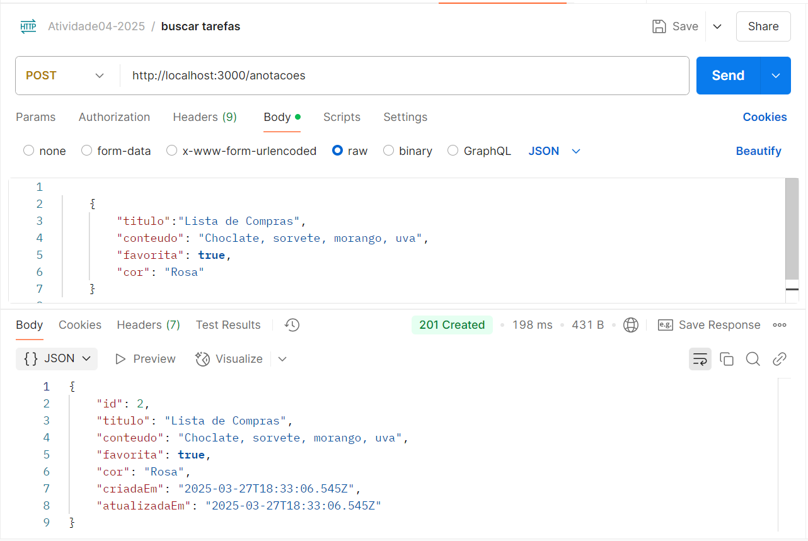

# Atividade: API de Anotações Pessoais com Prisma ORM

## Contexto do Desafio da Atividade

A startup **NoteHub** está desenvolvendo um aplicativo simples de anotações digitais para estudantes. O objetivo é criar uma API backend para armazenar e gerenciar as anotações dos usuários. Esta é a versão 1.0 do projeto, focada exclusivamente em funcionalidades básicas de anotações, sem sistema de usuários ou categorias complexas.

---

## Funcionalidades da API

A API REST desenvolvida para o sistema **QuickNotes** oferece as seguintes funcionalidades:

- **Criar novas anotações**
- **Listar todas as anotações**
- **Buscar anotação por ID**
- **Atualizar anotações existentes**
- **Excluir anotações**
- **Marcar anotações como favoritas**

---

## Requisitos Técnicos

- **Modelo de dados simples com Prisma** (apenas uma tabela)
- **Estrutura do projeto** seguindo o padrão MVC
- **Programação assíncrona** utilizando `async/await`
- **Tratamento de erros adequado**
- **Validação de dados** nas requisições
- **Sistema de paginação** para listagem de anotações *(Opcional)*

---

## Modelo de Dados

O modelo de dados foi implementado utilizando o Prisma ORM. A tabela `notas` segue a estrutura abaixo:
**IMAGEM**

## Como executar o Projeto

1. clone o repositorio
git clone https://github.com/Mariaeduardar07/APIBackcomPrisma.git

2. Instale as dependências 
npm install

3. Crie o arquivo .env e configure o banco de dados no arquivo
DATABASE_URL="file:./dev.db"

4. Execute as migrações do Prisma:
npx prisma migrate dev

5. Inicie o servido
npm run dev

## Endpoints da API

- **Criar novas anotações**

- **Listar todas as anotações**

- **Buscar anotação por ID**
- **Atualizar anotações existentes**
- **Excluir anotações**
- **Marcar anotações como favoritas**
